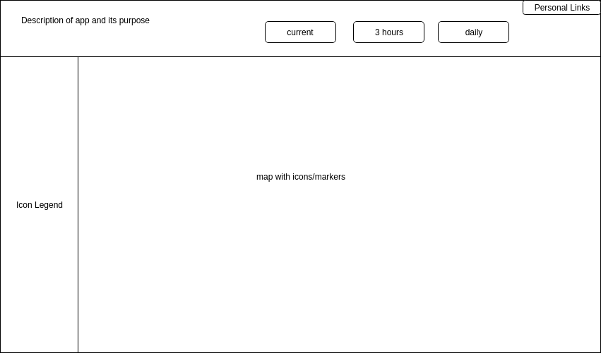

# CaliClimbs
## Background and Overview
A data visualization tool designed to inform users of up to date weather conditions for popular rock climbing locations in California.

Users are able to check current weather statuses, but also visually see what the weather looks like at a specified climbing spot on the map.

## Functionality and MVP
In CaliClimbs, users have the ability to:

- [ ] Interact with the map
- [ ] view information via markers
- [ ] Check different time frequencies of weather updates via a list (current, every 3 hours, daily)

In addition,
- [ ] A header with information about the app
- [ ] A sidebar that serves as an icon legend

## Wireframe
The app will be a single screen displaying a map.  There will be many markers/icons displaying current weather information on the map.

Header will display any basic information for the app such as a description and any links.  

Icons on the map will represent current weather status such as sunny, rainy, cloudy etc.  Clicking on icon will display more in-depth weather information.

## Architecture and Technologies
This project will be implemented with the following technologies:
* Vanilla Javascript for overall structure
* Google Maps API for map implementation
* Mountain Project Routes API for locations of popular climbing areas
* OpenWeatherMap API for weather information
* Webpack to bundle and serve scripts

In addition to the webpack entry file, there will be other scripts:

`map.js` to establish a map

`weather.js` to handle the weather data for specified locations

`routes.js` to manage the data on finding climbing routes

`marker_manager.js` to handle the creation of Maps markers and how a user can interact with them

## Implementation Timeline
**Over the weekend**:
- [x] Look for various API's to support this project (weather, maps, routes location)
- [x] Read the docs

**Day 1**: Focus on Map and setup
- [ ] Setup `Webpack` and appropriate entry file
- [ ] Relearn and implement Google Maps API and Marker Maker API
- [ ] Learn and implement Mountain Project Routes API for popular locations

**Day 2**: Focus on most basic weather level
- [ ] Learn and implement weather api
- [ ] get current weather reports for locations

**Day 3**: Focus on more levels of weather
 - [ ] Add in 3 hour forecast
 - [ ] Add in 5 day forecast

**Day 4**: Style and Polish the page
- [ ] create header instructions
- [ ] style markers/information popups

## Bonus Features
Future additions could include

Road Traffic/Closures
- [ ] Toggle to see what roads are open/closed

User Features
- [ ] Expand overall area coverage
- [ ] Allow users to add a new location
- [ ] Toggle Boulder Routes based on climbing type (Trad, Sport, Boulder)
